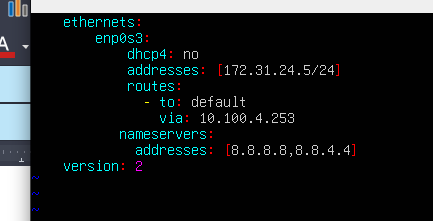

# Configurar o Oracle Virtual Box

- Gerenciador de arquivos -> Arquivo -> Conectar a um servidor -> Colocar o servidor 10.103.63.75 e protocolo FTP -> Copiar

## Tipos de rede

- Bridge
- Rede interna
- NAT

## Máquina Virtual

- A máquina principal é o **hospedeiro**, que possui um sistema operacional
- O Oracle Virtual Box é um software para fins educacionais que permite que a gente crie **máquinas virtuais** dentro do sistema operacional
- Os Hipervisors são utilizados para 
    - Pode ser VM
    - HyperV
    - Proxmox
- Criar um servidor virtual
    - Nome da máquina e S.O
        - Ubuntu1-Henrriky
        - Selecionar a ISO do servidor FTP
        - Selecionar pular instalação desassistida
    - Hardware
        - 2048 MB.
    - Disco virtual
        - Primeira opção
    - Instalação do S.O
        - English
        - Continue
        - Layout: PT-BR
        - Ubuntu Server
        - Done
        - Permitir formatação do disco virtual
        - Done
        - Continue
        - Nome: ifsp01
        - Servidor: ifsp
        - Usuario: ifsp01
        - Senha: ifsp01
        - Done e aguardar a instalação
    - Configuração adicional
        - Desligar a máquina
        - Armazenamento -> Remover disco virtual
        - Memória -> 768

### Comandos

- Ir para a pasta do usuário logado: `cd ~`
- Limpa o terminal
    - `clear`
    - `CTRL + l`
- Criar um atalho para um comando
    - `alias c=clear`
    - O alias funciona apenas para a sessão atual.
    - `alias`
- Descobrir usuário da sessão atual
    - `whoami`
    - Usuário padrão não é **superusuário**
    - O símbolo "$" indica que o usuário atual sendo utilizado não tem privilégios de administrador
    - O **superusuario** é o **root**
- Realizar o login como **superusuario**
    - `su root`
    - `sudo su -`
        - Colocar a senha
        - O símbolo "#" e o resultado do `whoami` indicam que o usuário da sessão atual é o "root"
- Sair da sessão atual (Logout)
    `exit`
- `alias`: Listar os alias
- `pwd`: Exibir o diretório de trabalho da sessão atual
- `cd /`: Mudar de diretório raiz
    - `cd ~`: Mudar para o diretório home da sessão atual
- `ls`: Lista todos os arquivos e diretórios do diretório de trabalho atual.
    - `ls -l --color=none`: Não mostrar as cores
    - `ls -l`: Lista todos os arquivos, diretórios e subdiretórios mostrando detalhes.
        - Começa com `-` Arquivo
        - Começa com `d` Diretório
        - Começa com `l` Atalho
    - `ls -la`: Mostrar arquivos ocultos.
    - `l --color=none`
- `printenv`: Listar todas as variáveis de ambiente
- `echo $PATH`: Exibir o valor da variável $PATH
    - `echo "Eu mesmo" > file.txt`
- `cat filename.txt`: Mostra o conteúdo do arquivo 
- `cp filename.txt filename-copy.txt`
- `ss -uln`: Mostra os sockets UDP ativos no Sistema Linux:
    - `ss -tln`: Mostra os sockets TCP ativos
    - `ss -xln`: Mostra os sockets Unix Domain ativos
    - `ss --family=FAMILY`: Mostra sockets do tipo FAMILY
    - `ss -tulpn`: 
    - Linux Sockets
        - https://phoenixnap.com/kb/linux-socket
- `shutdown -h now`: Desligar a máquina virtual

### Exportar a maquina virtual

- Arquivo -> Exportar -> Selecionar o arquivo

### Importar maquina virtual

- Arquivo -> Importar Appliance -> Selecionar o arquivo

### AA3

- Evidência: Arquivos de configuração e fotos
- Criar uma máquina virtual 
- Utilizar essa máquina virtual com ubuntu para criar o Client e Server
- Colocar as duas máquinas virtuais em modo "Rede Interna".
    - Configurações -> Rede -> Rede Interna
- Configurar IP Privado RFC1918
    - 10.X.X.X
    - 172.16 a 172.31
    - 192.168.x.x
    - cd /etc/netplan
    - ls
    - 00-installer-config.yaml
    -
    - cp faz backup
    - vim 00.....
    - netplan apply
    - ip a (Visualizar IP)
    - Configuração
        |--- VM1-Server
        |    - 10.90.1.50/24
        |--- VM2-Client
        |    - 10.90.1.100/24
        |
        Router (10.90.1.200)
            - routes:
                - to: default
                - via: 10.90.1.200

========
172.31.24.5/24
172.31.24.6/24
- ip a: Lista as interfaces de rede e os IP's configurados
- ip route: Mostra o gateway padrão

# Referências

- https://www.geeksforgeeks.org/linux-network-commands-cheat-sheet/
- https://www.atatus.com/blog/linux-networking-commands-and-scripts/

